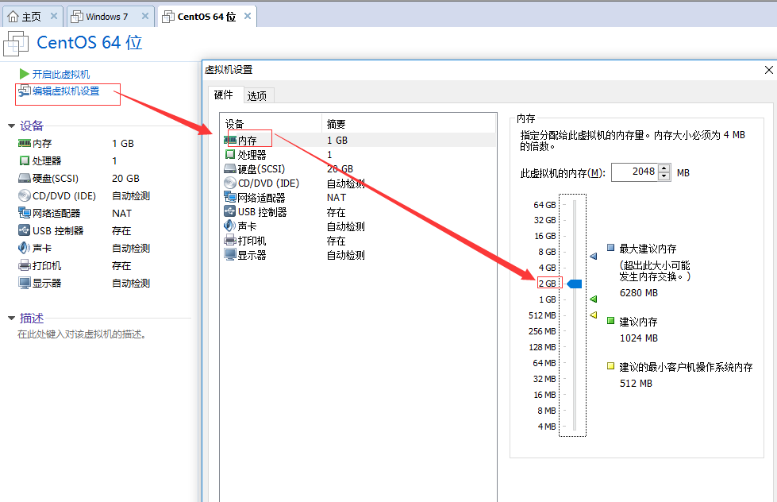
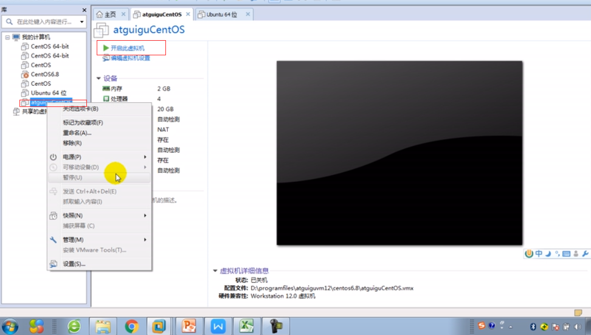
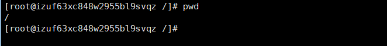
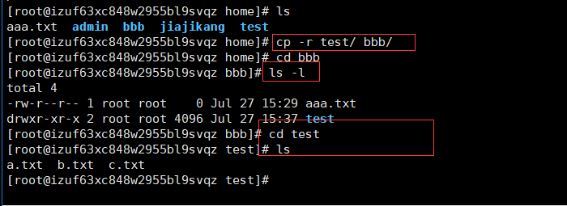
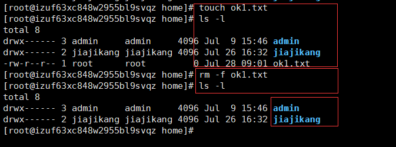
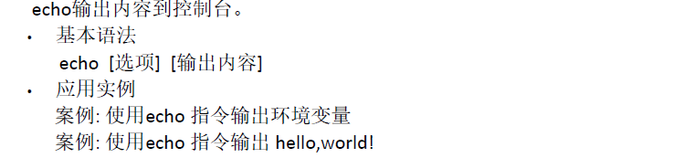

# 第一章 Linux开山篇

## 1.1  内容介绍


## 1.2 Linux学习方向

1.2.1 Linux运维工程师

1.2.2 Linux嵌入式工程师

1.2.3 在linux下做各种程序开发


## 1.3 Linux应用领域

### 1.3.1 个人桌面应用领域

### 1.3.2 服务器应用领域

### 1.3.3 嵌入式应用领域


## 1.4 Linux高手进阶阶段


```c
1.4.1 Linux基本操作命令

1.4.2 Linux格式配置

1.4.3 Linux下如何搭建对应语言的开发环境

1.4.4 Linux下能编写sheel脚本，对Linux服务器进行维护

1.4.5 能进行安全设置，防止攻击，保障服务器正常运行，能对系统调优

1.4.6 深入理解Linux系统(对内核有研究)，熟练掌握大型网站应用架构组成、并熟悉各个环节的部署和维护方法

```

## 1.5 Linux的学习方法和建议

1、高效而愉快的学习

2、先建立一个整体框架，然后细节

3、==不需要掌握所以的Linux指令，要学会查询手册和百度。==

4、先know，how，在know，why

5、计算机是一门“做中学”的学科，不是会了再做，而是做了才会。

6、适当的囫囵吐枣(有些地方实在不理解，往后在看)

7、==Linux不是编程，重点是实际操作，各种常用的指令要玩的溜==。

# 第二章 Linux基础篇  Linux入门

## 2.1 Linux介绍

1、Linux怎么读：【里纽克斯，利尼克斯，里纳克斯】

2、Linux是一款操作系统，免费，开源，安全，高效，稳定，==处理高并发非常强悍==，现在很多企业级的项目都部署到Linux/unix服务器运行。

3、Linux创始人托瓦斯(Linus Torvalds)

4、Linux吉祥物

​       企鹅：tux

5、Linux主要的发行版本


6、目前主要的操作系统

​        windows，Android安卓，车载系统linux等

## 2.2 unix是怎么来的 


## 2.3 Linux是怎么来的


## 2.4 Unix和Linux的关系


## 2.5 Linux和windows的比较(了解)


==P7结束==

# 第三章 Linux基础篇VM和Linux系统(CentOS)安装


## 3.1 安装VM和CentOS

   

### 3.1.1 获取VM

​       链接：https://pan.baidu.com/s/1rlXUYOXVm9REdiwGyk5Dsg 密码：b4fy

###3.1.2 获取CentOS

 <http://mirrors.163.com/centos/6/isos/>

### 3.1.3 安装VM

1、进去BIOS中修改设置开启虚拟化设备支持(f2,f12)

2、安装虚拟机软件

链接：https://pan.baidu.com/s/1IxLAtsCIjbhbTHj5ADPFFg 密码：0sse

### 3.1.4  安装CentOS(视频9)

#### 3.1.4.1 创建虚拟空间

**1、检查BIOS虚拟化支持**

首先重启电脑，开机后按delete键进入BIOS，不同的主板进入BIOS的按键不同，有些是F2，F8，F12，不知道主板型号的下载[鲁大师](http://www.ludashi.com/)查看，网上搜索一下自己的主板进入BIOS的按键。

进入BIOS后，找到Virtualization Technology，把Disabled改为Enabled，然后选择Save & Exit Setup，按Y就可以了。

**2、创建虚拟空间**


**3、典型(推荐)**


**4、第四步**


**5、第五步**


**6、第六步**


**7、第七步**


**8、结果**


#####3.1.4.1.1 设置centos

**1、第一步：内存设置**



**2、第二步：处理器设置**


**3、网络适配器设置(难点)**

**3.1 桥连**


​     linux系统可以和其他的系统通信，但是可能造成IP冲突

**3.2 NAP模式**

 

**3.3 主机模式**

​         linux是一个独立的主机，不能访问外网。

​         设置完成之后，点击：确定


####3.1.4.2 安装系统(CentOS6.8)

1、第一步：虚拟机-->设置


2、第二步：CD/DVD


3、第三步：开启虚拟机


<https://www.bilibili.com/video/av46229928/?p=9>

往下的步骤，可参考上述链接中视频。

==注：==

   <font color=red>再三考虑之下，购买了阿里云的轻量级服务器，至此，开始配置服务器和本地之间的交互。</font>

按照完毕之后，系统的内部构造如下图所示：


### 3.1.5  安装putty

​         获取链接：<https://www.chiark.greenend.org.uk/~sgtatham/putty/latest.html>

​         傻瓜式安装

### 3.1.6 客户端(putty)使用密钥连接

1. 
2. 
3. 启动putty
4. 
5. 点击open
6. 


#### 3.1.6.1 putty设置

​       putty常用设置：<https://www.cnblogs.com/hdk1993/p/4769072.html>

​      putty复制粘贴：<http://www.phperz.com/article/16/0131/188674.html>


## 3.2  查看centos目录情况

```
命令：
cd /
ll  // 显示当前文件有哪些
```

 

## 3.3 终端使用和联网

**终端使用：**因为我使用的是阿里云centos服务器，所以，配置的是putty与其连接，进行终端操作

**联网：**这里就以本地VM中的centos为例：1：配置网络，2：右上角电脑电脑图标：system eth0

**资源由来：**视频10

## 3.5 安装vmtools

vmtools 安装后，可以让我们在windows下更好的管理vm虚拟机

**1、可以直接粘贴命令在windows 和centos系统之间**

**2、可以设置windows和centos的共享文件夹**

**3、示意图**


==安装vmtools步骤==

1.进入centos

2.点击vm菜单的->install vmware tools

3.centos会出现一个vm的安装包（会出现一个VMwareTools.tar压缩包）

​    复制到指定文件夹下：opt/vmwareTools.tar

4.点击右键解压, 得到一个安装文件

 5.进入该vm解压的目录，该文件在/root/桌面/vmware-tools-distrib/下

6.安装./vmware-install.pl

7.全部使用默认设置即可

8.需要reboot重新启动即可生效

 <font color=red>命令解压玩法：</font>

```c
cd /opt/
ls
tar -zxvf 解压文件名    # 解压命令
cd 解压出来的文件夹名称   # 进入到解压得到的文件夹目录下
ls # 查看
./vaware-install.pl # 一路回车
reboot # 重启
```

## 3.6 设置共享文件夹

使用vmtool来设置windows和Linux的共享文件夹，具体步骤:
1) 菜单->vm->setting, 如图设置即可
     注意:设置选项为always enable ，这样可以读写了
2) windows和centos可共享d:/share目录
     可以读写文件了
3)在centos的/mnt/hgfs/ 下 # 默认放在此路径下


## ==3.7 Linux的目录结构==

### 3.7.1 基本介绍

基本介绍:

linux的文件系统是采用级层式的==树状目录结构==，在此结构中的最上层是==根目录“/”==，然后在此目录下再创建其他的目录。

深刻理解linux树状文件目录是非常重要的，这里我给大家说明一下。
记住一句经典的话：==在Linux世界里，一切皆文件。==


```c
/dev 管理设备

/media linux系统会自动识别一些设备，例如U盘，光驱等等，当识别后，linux会把识别的设备挂载到这个目录下

/bin 常用的命名

/sbin s就是super user的意思，这里存放的是系统管理员使用的系统管理程序。

/home 存放普通用户的主目录，在linux中每个用户都有一个自己的目录，一般该目录名是以用户的账号命名的。

/root 系统管理员，也称作超级权限者的用户主目录。

/lib  系统开机所需要最基本的动态连接共享库，其作用类似于Windows里的DLL文件。几乎所有的应用程序都需要用到这些共享库。

/lost+found 这个目录一般情况下是空的，当系统非法关机后，这里就存放了一些文件。

/etc [重点] 所有的系统管理所需要的配置文件和子目录my.conf

/usr [重点] 这是一个非常重要的目录，用户的很多应用程序和文件都放在这个目录下，类似与windows下的program files目录。

/boot [重点] 存放的是启动Linux时使用的一些核心文件，包括一些连接文件以及镜像文件

[
   高手动的
   /proc  这个目录是一个虚拟的目录，它是系统内存的映射，访问这个目录来获取系统信息。
   /srv service缩写，该目录存放一些服务启动之后需要提取的数据。
   /sys 这是linux2.6内核的一个很大的变化。该目录下安装了2.6内核中新出现的一个文件系统sysfs
]


/tmp 这个目录是用来存放一些临时文件的。

/dev 类似于windows的设备管理器，把所有的硬件用文件的形式存储。

/media [重点] linux系统会自动识别一些设备，例如U盘、光驱等等，当识别后，linux会把识别的设备挂载到这个目录下。

/mnt [重点] 系统提供该目录是为了让用户临时挂载别的文件系统的，我们可以将外部的存储挂载在/mnt/上，然后进入该目录就可以查看里的内容了。d:/myshare


/opt 这是主机额外安装软件所摆放的目录。

/usr/local 这是另一个给主机额外安装软件所安装的目录。一般通过编辑源码方式安装的程序。

/var [重点]这个目录中存放着在不断扩充着的东西，习惯将经常被修改的目录放在这个目录下。包括各种日志文件。

/selinux 是一个安全子系统，她能控制程序只能访问特定文件。有点类似360
```

==home==

useradd tom  # 在home目录下，分配一个tom文件夹

userdel -r tom # 删除创建的tom文件夹


### 3.7.2 ==inux目录总结：==

1、linux的目录中有且只有一个根目录/

2、linux的各个目录存放的内容是规划好的，不要乱放文件。

3、linux是以文件的形式管理我们的设备，因此linux系统，一切皆为文件。

<font color=red>4、linux的各个文件目录下存放什么内容，一定要熟记。</font>

<font color=red>5、学习后，脑海中应该要有一个linux目录树</font>


# 第四章 Linux实操篇

## 4.1、 为什么要远程登录到Linux

说明: 公司开发时候，具体的情况是这样的

```c
1) linux服务器是开发小组共享的.

2) 正式上线的项目是运行在公网的.

3) 因此程序员需要远程登录到centos进行项目管理或者开发.

4) 画出简单的网络拓扑示意图(帮助理解)

5) 远程登录客户端有Xshell5，Xftp5 , 我们学习使用Xshell5 和Xftp(远程上传，下载) , 其它的远程工具大同小异.

```


## 4.2 安装Xshell5和xftp5

### 4.2.1 安装Xshell5

==介绍:==

说明: Xshell 是目前最好的远程登录到Linux操作的软件，流畅的速度并且完美解决了中文乱码的问题，是目前程序员首选的软件。

Xshell[1]是一个强大的安全终端模拟软件，它支持SSH1, SSH2, 以及Microsoft Windows 平台的TELNET 协议。

Xshell可以在Windows界面下用来访问远端不同系统下的服务器，从而比较好的达到远程控制终端的目的。

==安装==

傻瓜式安装即可

==连接==

1、ipconfig：查看IP

2、Xshell5运行连接界面


3、

账号：jiajikang.pem

密码：jiajikang1993


备注：reboot # 重启命令行

  ### 4.2.2  安装Xftp

是一个基于windows平台的功能强大的SFTP、FTP文件传输软件。使用了Xftp 以后，windows 用户能安全地在UNIX/Linux和Windows PC 之间传输文件。

==傻瓜式安装即可==

==配置和使用==

1、


2、

主机：IP

协议：SFTP

端口：22

用户名：root

确认

3、

用户密钥：jiajikang.pem

用户密码：jiajikang1993


==当连接成功后，出现乱码时候，如何解决xftp中文乱码问题？==


## 4.3  vi 和vim编辑器

所有的Linux 系统都会内建vi 文本编辑器。Vim 具有程序编辑的能力，可以看做是Vi的增强版本，可以主动的以字体颜色辨别语法的正确性，方便程序设计。代码补完、编译及错误跳转等方便编程的功能特别丰富，在程序员中被广泛使用。

### 4.3.1 vi 和vim的三种常见模式

==正常模式:==

​         以vim 打开一个档案就直接进入一般模式了(这是默认的模式)。在这个模式中，你可以使用『上下左右』按键来移动光标，你可以使用『删除字符』或『删除整行』来处理档案内容，也可以使用『复制、贴上』来处理你的文件数据。

==插入模式:==
                 按下i, I, o, O, a, A, r, R等任何一个字母之后才会进入编辑模式, 一般来说按i即可.

==命令行模式==
                 在这个模式当中，可以提供你相关指令，完成读取、存盘、替换、离开vim 、显示行号等的动作则是在此模式中达成的！


==说明==

```
:q! # 强制退出，写入了一些东西，但是不想保存，就使用此命令
:wq # 写入退出
:q  # 退出，不保存
```

==步骤：==

```java
1. vim hello.java # 进去到正常模式

2. 输入：i 进入到插入模式

3. 开始写入内容

4. 写完之后，要先进入到命令行模式：esc

5：生成：:wq #，写入并退出，保存的意思
```

### 4.3.2 vi 和vim的快捷键

 


 

## 4.4  开机、重启和用户注销

### 4.4.1 关机&重启


### 4.4.2 用户的登录和注销


==目前是root用户==

==注销==


# 第五章 实操篇-用户管理

1.  Linux系统是一个多用户多任务的操作系统，任何一个要使用系统资源的用户，都必须首先向系统管理员申请一个账号，然后以这个账号的身份进入系统。
2.  Linux的用户至少要属于一个组
3.  当创建用户成功后，会自动的创建和用户同名的家目录
4.  也可以通过useradd -d 指定目录新的用户名，给新创建的用户指定家目录


## 5.1 添加用户

### 5.1.1 基本语法

useradd   [选项] 用户名

###5.1.2 添加用户：useradd 用户名

==实际案例-添加用户==

1、添加一个用户：jiajiknag


 2、切换到home目录下


3、新建一个目录


### 5.1.3 指定密码：passwd

​       密码：passwd jiajikang1993


  5、创建新用户且指定密码

​         用户：/home/tiger xiaomin

​        密码：xiaomin


## 5.2 删除用户

==userdel 用户名==

 1)删除用户xiaomin，但是要保留家目录


 2)删除用户以及用户主目录

==userdel -r 用户名==


==一般来说：尽量保留家目录==

## 5.3 查询用户信息


## 5.4 切换用户信息


## 5.5 查看当前用户/登录用户

### 5.5.1 查看当前用户


### 5.5.2 用户组

类似于角色，系统可以对有共性的多个用户进行统一的管理

==创建一个组==：groupadd 组名

==删除一个组==：groupdel 组名

==增加用户时直接加上组==：useradd -g 用户组 用户名

增加一个用户 zwj，直接将它指定到wudang组


### 5.5.3 修改用户的组

创建一个shaolin组，让将zwj用户修改到shaolin组

groupadd shaolin # 创建一个shaolin组

usermod -g shaolin zwj # 将zwj用户修改到shaolin组


## 5.6 用户和组的相关文件


# 第六章 实操篇-实用指令

## 6.1 运行级别和找回root密码

行级别说明：

0 ：关机

1 ：单用户【找回丢失密码】

2：多用户状态没有网络服务

3：多用户状态有网络服务

4：系统未使用保留给用户

5：图形界面

6：系统重启

常用运行级别是3和5 ，要修改默认的运行级别可改文件==/etc/inittab的id:5:initdefault==:这一行中的数字
命令：init [012356]

通过init 来切换不同的运行级别


==切换==

直接在命令行下：init 数字

==如何找回root密码==

思路：进入到单用户模式，然后修改root密码。

因为：进入到单用户模式，root不需要密码就可以登录。

==演示==



```c
1. 重启开机
2. 快速按回车键进入
3. 根据提示按键
4. 光标移动的“kernel...”下 ,再次输入一个：‘e’
5. 空格 1
6. enter键
7. 输入:‘b’
8. 以root身份进入的单用户模式
9. passwd root
10. 设置米明
11. 重启
```

## 6.2 文件目录类指令_01

### 6.2.1 pwd查看当前路径指令

显示当前工作目录的绝对路径



 ### 6.2.2 ls查看当前文件指令


### 6.2.3 cd切换指令


==案例1:使用绝对路径回到root==

cd /root


==案例2:回到当前目录的上一级目录==

cd ..

==案例3:回到家目录==

cd

cd ~


## 6.3 文件目录类指令_02

### 6.3.1 mkdir(make directory)


==案例1：创建一个目录 /home/dog==


==案例2：创建多级目录 /home/animal/tiger==


### 6.3.2 rmdir


==删除非空目录文件：rm -rf==


## 6.4 文件目录类指令_03

### 6.4.1 touch创建空文件指令


创建一个空文件：hello.txt


### 6.4.2 cp复制指令


==案例1==

 

==案例2==

将/home/test下整个目录拷贝到/home/bbb目录下



## 6.5 文件目录类指令_04

### 6.5.1 rm指令


==删除一个目录==




### 6.5.2 mv指令


## 6.6 文件目录类指令_05

###6.6.1 cat(只读方式查看文件内容)


注：etc


### 6.6.2 more全屏方式查看文本文件内容


### 6.6.3 less分屏查看文件内容


## 6.7 文件目录类指令_06

### 6.7.1 >指令和>>指令


==追加写入==


### 6.7.2 echo输出内容到控制台




### 6.7.3 head显示文件的开头部分内容


### 6.7.4 tail现任文件的末尾部分内容


### 6.7.5 ln


==删除软连接==


### 6.7.6 history查看已经执行历史命令...


## 6.8  时间日期类_01

### 6.8.1 date-显示当前日期


### 6.8.2 date-设置日期


### 6.83 cal 查看日历指令


## 6.9 搜索查找类_01

### 6.9.1 find


### 6.9.2 locate


### 6.9.3 grep过滤查找


## 6.9 压缩和解压类

